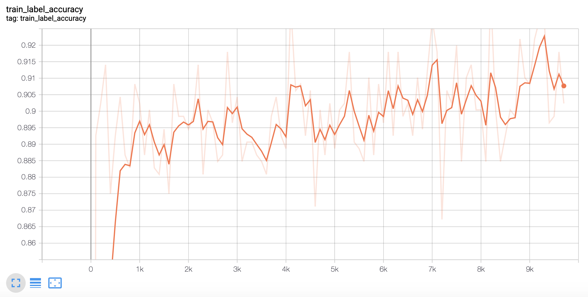
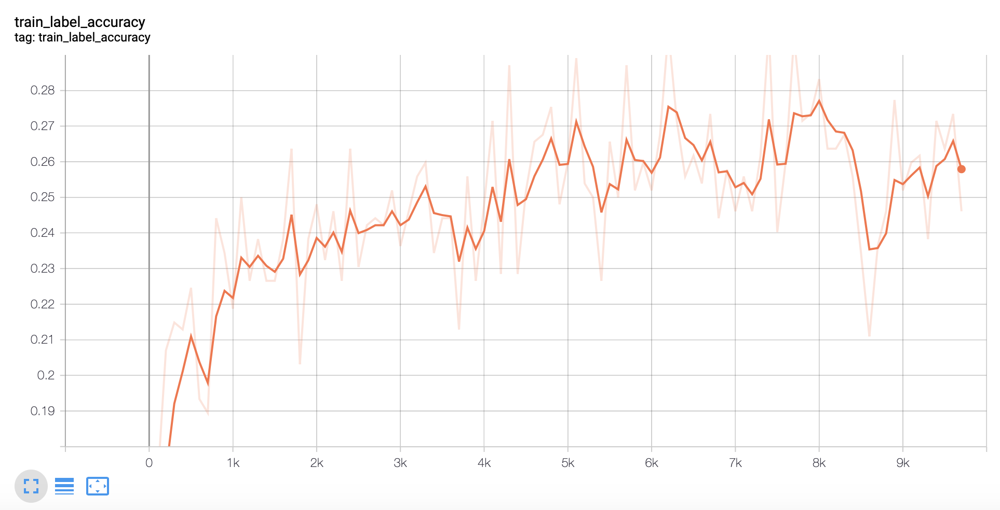

## Test [simclr](https://paperswithcode.com/paper/a-simple-framework-for-contrastive-learning) with [Weights & Biases](https://www.wandb.com)

This document is a step-by-step guide to reproduce a problem when using W&B for hyperparameter tuning. This might be
a specific problem when W&B is used for simclr. In the hope of finding the root cause of the issue, this document is
an effort to allow the problem to be easily reproducible.

### Summary of the problem

When using wandb for grid search sweep of hyperparameters during simclr finetuning step, accuracy drops drastically and
systematically. For the same set of parameters, the accuracy drops from over 90% to below 30%. 

The change to add wandb API calls is minimal, from [run.py](run.py) (without using wandb) to 
[run_sweep.py](run_sweep.py) (with wandb).

### Set up

We use docker to run simclr pretraining and finetuning, on Nvidia GPU Tesla V100.
```shell script
make container
```

We also use docker to run W&B sweep.
```shell script
make wandb_container WANDB_BASE_URL=http://wandb.host:port
```

### Pretrain simclr with CIFAR-10

To pretrain the model on CIFAR-10 with a single GPU, try the following command:
```shell script
make simclr DATA_DIR=/host/path/data

# inside docker
tf-docker /app > make run_pretrain DATA_DIR=/data/cifar10 MODEL_DIR=/data/cifar10_model |& tee run_pretrain.log
```
where `/host/path/data` is arbitrary.

### Finetune simclr with CIFAR-10

To fine-tune a linear head (with a single GPU), try the following command:
```shell script
make simclr DATA_DIR=/host/path/data

# inside docker
tf-docker /app > make run_finetune DATA_DIR=/data/cifar10 CHECKPOINT=/data/cifar10_model MODEL_DIR=/data/cifar10_model_ft |& tee run_finetune.log
```

As a reference, the above runs on CIFAR-10 should give you around 91% accuracy, which will be used to compare with W&B.

### Create W&B sweep

First create a W&B project simclr.


Use the example sweep configuration in [finetune_cifar10_wandb.yaml](finetune_cifar10_wandb.yaml) to create a sweep.
You'll also need a WANDB_DIR that contains this file.
It will be loaded into the /data directory of the container.

```shell script
make create_sweep WANDB_BASE_URL=... WANDB_DIR=... WANDB_USERNAME=... WANDB_API_KEY=... WANDB_PROJECT=simclr SWEEP_CONFIG=...
```

Record the sweep id, and use it in the next section.

### Start W&B sweep

```shell script
make start_sweep WANDB_BASE_URL=... WANDB_DIR=... WANDB_USERNAME=... WANDB_API_KEY=... WANDB_PROJECT=simclr SWEEP_ID=...
```

### Comparison


<div align="center">
  Finetune Result for CIFAR10
</div>


<div align="center">
  Finetune Result for CIFAR10 with W&B Sweep
</div>
